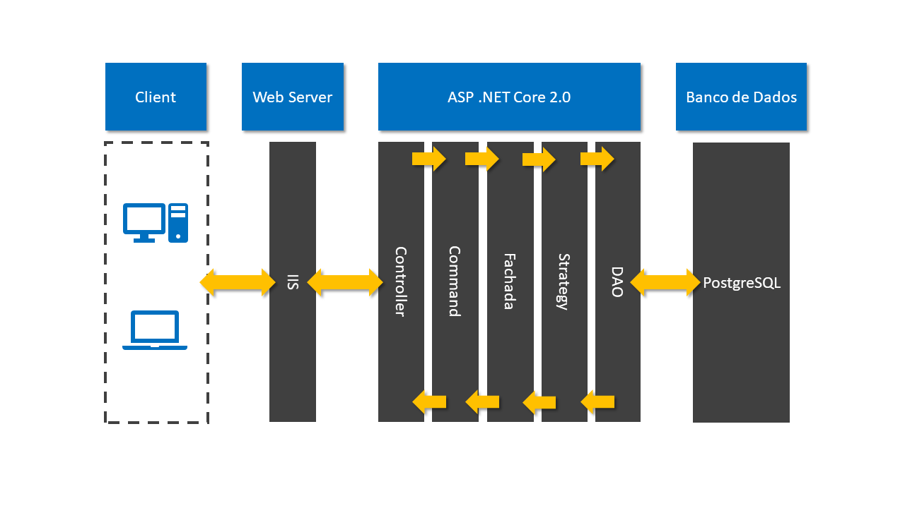

# E-Commerce of Books

This project was created to be presented as final work for my graduation.

## How it Works?

This diagram above shows how it was created the architecture of the application going from the client to the PostgreSQL and returning.

It begins with the client making a request to our **web server IIS**. Then it hits the **Controller**, which creates the object that it best suites the desired response to the cliente.

That object goes to the right **Command**. The right command send the object to our **Facade** (_Fachada in pt/br_).

The Facade class has all of the **Strategies** mapped to each operation possible on the application. These strategies are responsible for executing the business rules and return if it's succeed or failed on doing it.

The strategies are responsible for consulting the database through de DAO classes. These DAO will return to the strategy the result of the queries on the database.

And then the result goes all the way back to the user with the response also in a Object called _Resultado_ (result in english).

**Example of an error detected on a strategy**: every user needs to have a name, so when an object _User_ reaches the strategy responsible for verifying the required fields without the name on it, the strategy will return an error message to the Facade who will return to the command and who will return to the controller which will going to return to the user.

_Command could be Create, Read, Update or Delete_

## Built With

- ASP .Net Core 2.0
- PostgreSQL
- GoF Design Patterns Facade, Command, Strategy, DAO and Factory.

## License

MIT © [Samuel Monteiro](https://samuelmonteiro.netlify.com/)
